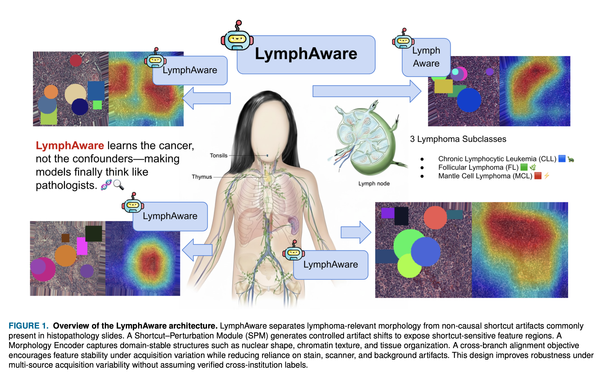
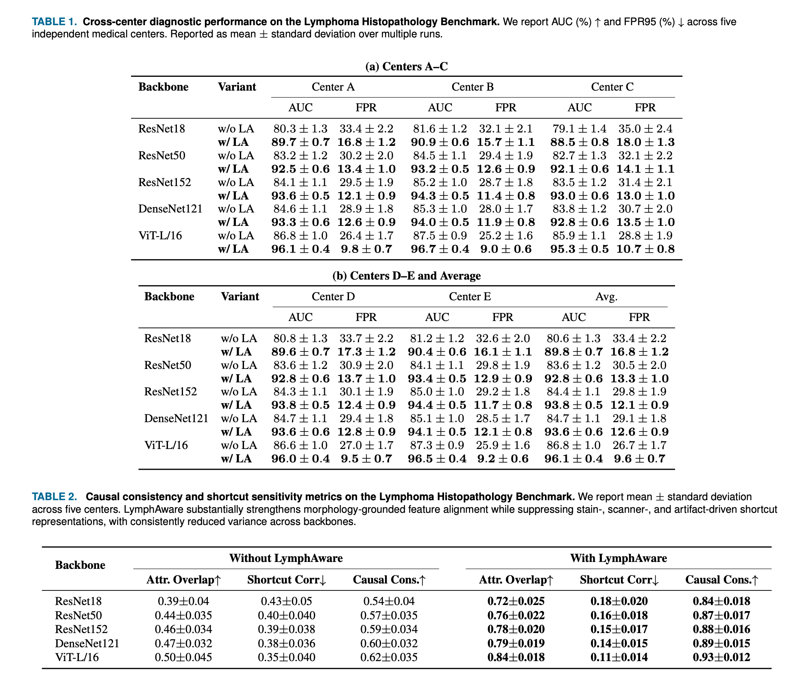
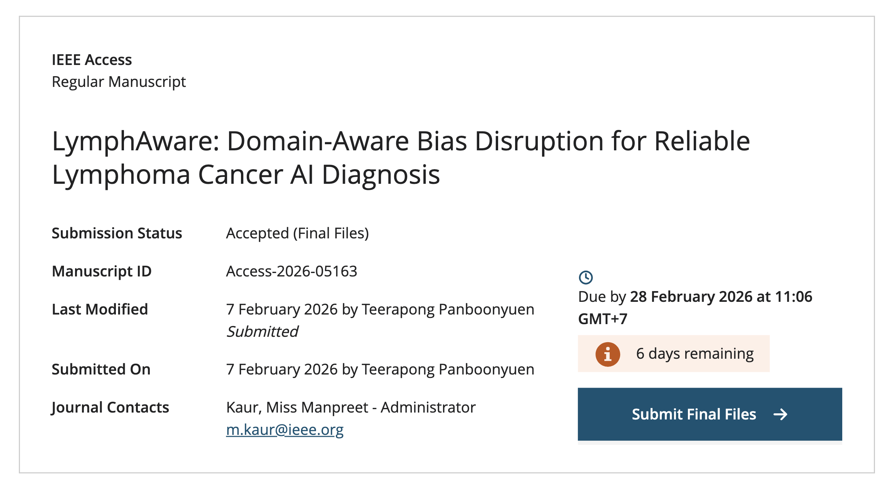

# 🧬 LymphAware: Domain-Aware Bias Disruption for Reliable Lymphoma Cancer AI Diagnosis

<div align="center">

<b>Author:</b> <b>Teerapong Panboonyuen</b><br/>
College of Computing, Khon Kaen University<br/>
Supported by the <i>Talent Scholarship for Exceptional Ability</i> 🌟 <br/><br/>

<b>Accepted at IEEE Access (Feb 21, 2026)</b> 🎉

</div>

---

<p align="center">
  
</p>

## 🚀 Overview

**LymphAware** is a domain-aware bias disruption framework designed to improve the **reliability, robustness, and clinical relevance** of AI systems for lymphoma histopathology diagnosis.

Modern medical AI models often achieve high accuracy by exploiting **non-biological shortcuts** — such as stain color, scanner signatures, or slide artifacts — instead of true pathological morphology. While effective in-domain, these shortcuts lead to **fragile performance under cross-center variability**, which is unacceptable for clinical deployment.

LymphAware explicitly addresses this challenge by **separating morphology-relevant signals from shortcut-driven acquisition factors**, enabling models to “think more like pathologists.” 🧠🔬

---

## ✨ Key Innovations

🔹 **Tri-Path Morphology Purification Architecture**

* Morphology-centric feature encoder
* Shortcut identification & suppression branch
* Cross-domain stability alignment stream

🔹 **Artifact-Shift Counterfactual Training**

* Simulated staining and scanner perturbations
* Exposure of latent shortcut dependencies
* Acquisition-invariant representation learning

🔹 **Domain-Aware Robustness Without Explicit Labels**

* Works under realistic multi-source settings
* No assumption of verified institutional separation

---

## 📊 Qualitative Results — Shortcut Suppression

<p align="center">
  
</p>

Models trained **without** LymphAware rely heavily on stain tone, background artifacts, and acquisition noise.
With LymphAware, attention shifts toward **diagnostically meaningful lymphoid morphology**.

---

## 📈 Cross-Center Performance

<p align="center">
  
</p>

Across five independent medical centers:

✅ Higher AUC
✅ Lower false positive rates
✅ Reduced variance across backbones
✅ Stronger causal consistency metrics

---

## 🏆 Acceptance Evidence

<p align="center">
  
</p>

This work has been **peer-reviewed and accepted** for publication in *IEEE Access*, highlighting its contribution to reliable medical AI research.

---

## 🧠 Why LymphAware Matters

Medical AI systems must be:

* ✔ Robust across scanners and hospitals
* ✔ Grounded in biological morphology
* ✔ Clinically interpretable
* ✔ Stable under domain shift

LymphAware moves the field closer to **trustworthy computational pathology** by addressing shortcut bias at the **representation level**, rather than relying solely on dataset curation or domain labels.

---

## ⚙️ Installation

```bash
git clone https://github.com/kaopanboonyuen/LymphAware.git
cd LymphAware
pip install -r requirements.txt
```

---

## ▶️ Usage

```bash
python train.py --config configs/lymphaware.yaml
```

Example evaluation:

```bash
python evaluate.py --checkpoint checkpoints/model.pth
```

---

## 📚 Citation

If you use this work, please cite:

```bibtex
@article{panboonyuen2026lymphaware,
  title={LymphAware: Domain-Aware Bias Disruption for Reliable Lymphoma Cancer AI Diagnosis},
  author={Panboonyuen, Teerapong},
  journal={IEEE Access},
  year={2026}
}
```

---

## 🙏 Acknowledgement

This research is supported by:

🎓 Talent Scholarship for Exceptional Ability
🏫 College of Computing, Khon Kaen University

---

## 🌟 Final Note

> **LymphAware learns the cancer — not the confounders.**

By enforcing morphology-grounded representations and suppressing shortcut bias, we aim to build AI systems that clinicians can truly trust.

---

⭐ If you find this project useful, please consider starring the repository!